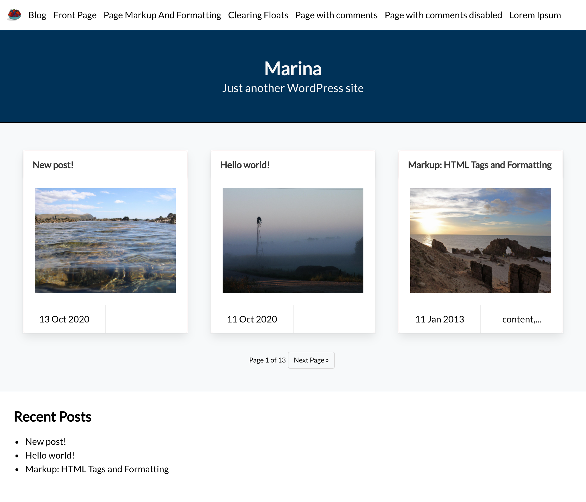

# Marina - A theme for the Wordpress blogging platform

Marina is a lightweight, open source theme for the  [Worpdress blogging platform](https://wordpress.com)

## Installation

If you want to use the theme for your own blog you can grab the latest zip file from the master branch. Upload this file via the backend or extract it into the wp-content/themes/ folder of your Wordpress installation. Then restart Wordpress and select the theme from the backend under Settings > Appearance > Themes. Alternatively, you can clone the repository into the wp-content/themes/ folder by using

```
git clone https://github.com/marinacornelie/ghost-theme-marina.git
```
## Screenshot

